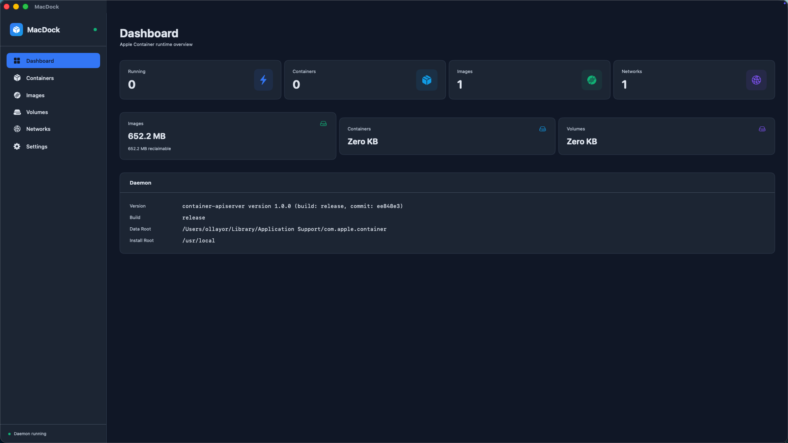

# MacDock

A native SwiftUI macOS GUI for [Apple Container](https://github.com/apple/container) — a Docker Desktop / OrbStack alternative built on Apple's container runtime.



## Features

- **Dashboard** — Live stats, disk usage, daemon health monitoring
- **Container Management** — Create, start, stop, delete containers with full configuration
- **Image Management** — Pull images from registries, inspect, delete
- **Volume Management** — Create, inspect, delete persistent storage
- **Network Management** — Create, inspect, delete virtual networks
- **Daemon Auto-Start** — Automatically starts `container-apiserver` on launch
- **Dark Theme** — Native macOS dark mode with custom color palette

## Requirements

- macOS 26+ on Apple Silicon
- [Xcode 26](https://developer.apple.com/xcode/) (full, not just CLI tools)
- [Apple Container CLI](https://github.com/apple/container/releases) installed

## Installation

### Build from Source

```bash
git clone https://github.com/olllayor/macdock.git
cd macdock/apple-container
swift build --product MacDock
.build/debug/MacDock
```

### Prerequisites

1. Install the container CLI from the [releases page](https://github.com/apple/container/releases)
2. Start the daemon: `container system start`
3. Configure the kernel: `container system kernel set --recommended`

## Usage

### Dashboard
- View live container/image/network/volume counts
- Monitor disk usage across all resource types
- Check daemon health and version info

### Containers
- **Create**: Click "New Container" — 5-tab form (General, Networking, Storage, Security, Advanced)
- **Manage**: Start, stop, delete containers from the list
- **Inspect**: View full container configuration
- **Logs**: Stream container stdout/stderr

### Images
- **Pull**: Enter image reference (e.g., `nginx:latest`)
- **Inspect**: View reference, digest, size
- **Delete**: Remove unused images

### Volumes
- **Create**: Enter name and driver
- **Inspect**: View volume details
- **Delete**: Remove volumes (with confirmation)

### Networks
- **Create**: Enter name and mode (NAT or Host Only)
- **Inspect**: View network details
- **Delete**: Remove custom networks (built-in "default" cannot be deleted)

## Architecture

```
MacDock SwiftUI App
    ↓ (XPC calls to container-apiserver)
container-apiserver daemon
    ↓
Containerization → Virtualization.framework → Linux VMs
```

MacDock communicates with the running `container-apiserver` daemon via XPC, using the same APIs as the `container` CLI.

## Project Structure

```
apple-container/
├── Sources/
│   ├── MacDock/                    # The GUI application
│   │   ├── MacDockApp.swift        # App entry point
│   │   ├── Services/               # XPC client wrappers
│   │   ├── Views/                  # SwiftUI views
│   │   └── Theme/                  # Colors and styling
│   ├── ContainerAPIClient/         # Container XPC client
│   ├── ContainerResource/          # Data models
│   └── ...                         # Other apple-container modules
├── Package.swift                   # SPM package definition
└── ...
```

## Contributing

1. Fork the repository
2. Create a feature branch
3. Make your changes
4. Run `swift build --product MacDock` to verify
5. Submit a pull request

## License

This project is based on [Apple Container](https://github.com/apple/container), which is licensed under the Apache License 2.0.

## Acknowledgments

- [Apple Container](https://github.com/apple/container) — The underlying container runtime
- [Apple Containerization](https://github.com/apple/containerization) — Swift package for container management
